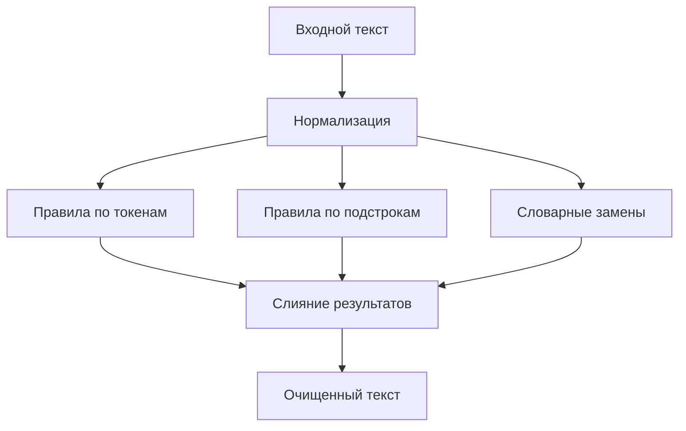

# Детерминированный пайплайн очистки токсичных фрагментов в татарском тексте

## Кратко
Правиловый пайплайн для модерации текста в low-resource сценарии: словарь, правила по токенам, правила по подстрокам и детерминированные замены.

## Задача
Построить прозрачный и управляемый контур очистки токсичных фрагментов в татарском тексте, не опираясь на большую размеченную выборку и тяжёлые модели.

## Что улучшено
- сочетание правил по токенам, подстрокам и словарных замен повышает покрытие по сравнению с одной группой правил;
- детерминированный подход делает преобразования объяснимыми;
- low-resource постановка делает правиловый baseline практически полезным.

## Архитектура


## Метрики и результаты
| Режим | Покрытие токсичных фрагментов | Сохранение смысла | Комментарий |
|---|---:|---:|---|
| token rules only | TBD | TBD | |
| token + substring rules | TBD | TBD | |
| token + substring + словарь | TBD | TBD | |

Для low-resource проекта допустима ручная оценка на фиксированном наборе примеров.

## Структура репозитория
- `main.py` — основная логика пайплайна;
- `toxic_replacements.json` — правила замен;
- `toxic_substrings.json` — правила по подстрокам;
- `tat_Cyrl_twl.txt`, `tt_ru_lexicon.csv` — словарные ресурсы;
- `paper.pdf` — связанный текстовый материал по проекту.

## Запуск
```bash
python -m venv .venv
source .venv/bin/activate
python main.py
```

## Ограничения
- правиловый подход ограничен полнотой словарей и правил;
- сложные контекстные случаи могут требовать отдельной модели;
- переносимость на другие домены и языковые варианты ограничена.

## Направления развития
- добавить ручной набор контрольных примеров;
- расширить типы правил;
- сделать пакетный режим обработки;
- добавить API для интеграции в модерационный контур.
